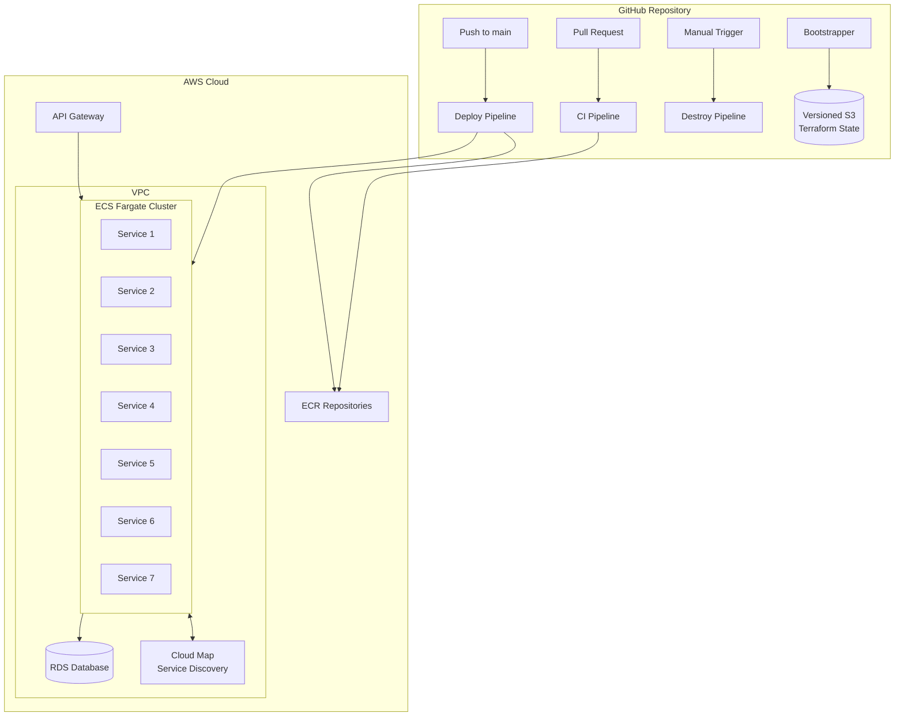
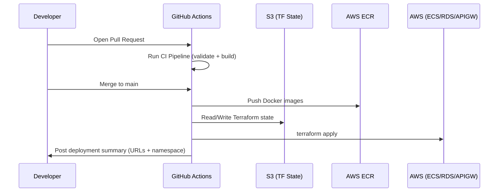

# 🛒 E-Commerce Microservices — AWS Cloud Infrastructure & CI/CD Pipeline


End-to-end, fully automated AWS infrastructure for a **7-service e-commerce application** — provisioned entirely with Terraform and deployed through a zero-manual-step CI/CD pipeline. No hardcoded credentials, no manual `terraform apply`, no manual Docker pushes — every deployment happens through a single `git push`.

---

## 📌 Overview

This project implements a production-grade, microservices-based e-commerce platform on AWS, fully automated from **code push → build → deploy → live URL**, using:

- **Terraform** for all infrastructure provisioning
- **ECS Fargate** for serverless container orchestration
- **GitHub Actions** for CI/CD automation
- **AWS Cloud Map** for internal service discovery
- **GitHub Secrets/Variables** for secure credential management

The result is a fully reproducible, secure, and auditable infrastructure that can be destroyed and rebuilt from scratch with zero manual intervention.

---

## 🏗️ Architecture



---

## ⚙️ Tech Stack

| Layer | Technology |
|---|---|
| Infrastructure as Code | Terraform |
| Container Orchestration | AWS ECS (Fargate) |
| Container Registry | AWS ECR |
| Networking | AWS VPC, Subnets, Route Tables |
| Database | AWS RDS |
| API Layer | AWS API Gateway |
| Service Discovery | AWS Cloud Map |
| CI/CD | GitHub Actions |
| State Management | Versioned S3 Backend |
| Secrets Management | GitHub Actions Secrets & Variables |

---

## 🚀 Key Highlights

- ✅ **Zero hardcoded credentials** — all AWS credentials, region configs, and DB passwords stored exclusively as GitHub Actions Secrets and Variables
- ✅ **Zero manual steps** — from `git push` to production, the entire pipeline runs unattended
- ✅ **7 independently deployable microservices**, each containerized and pushed to its own ECR repository
- ✅ **Internal service discovery** via AWS Cloud Map — no hardcoded internal IPs or endpoints
- ✅ **Idempotent bootstrap logic** — skips re-provisioning of existing ECR repositories on repeated runs
- ✅ **Auto-generated deployment summaries** — frontend URL, API Gateway URL, and Cloud Map namespace posted after every successful run
- ✅ **Safe teardown** — dedicated destroy workflow with a manual confirmation gate to prevent accidental infrastructure deletion

---

## 🧱 Infrastructure Provisioned (Terraform)

| Resource | Purpose |
|---|---|
| **VPC + Subnets** | Isolated network for all services (public + private) |
| **ECS Fargate Cluster** | Serverless compute for running all 7 microservices |
| **ECR Repositories** | One per microservice, stores versioned Docker images |
| **RDS Instance** | Managed relational database for the application |
| **API Gateway** | Single entry point routing external traffic to internal services |
| **Cloud Map Namespace** | DNS-based service discovery between microservices |

---

## 🔄 CI/CD Pipelines (GitHub Actions)

The automation is split into **4 dedicated workflows**, each with a single responsibility:

### 1️⃣ Bootstrapper
- Provisions a **versioned S3 bucket** to safely store Terraform state
- Runs once (or idempotently) before any infrastructure changes
- Prevents state file conflicts and enables safe rollback

### 2️⃣ CI Pipeline (on Pull Request)
- Validates Terraform configuration (`terraform validate`, `fmt`, `plan`)
- Builds Docker images for all 7 services to catch build failures early
- Runs before any code is merged, keeping `main` always deployable

### 3️⃣ Deploy Pipeline (on Push to `main`)
- Pushes built Docker images to their respective ECR repositories
- Runs `terraform apply` to reconcile infrastructure with the latest code
- Skips re-provisioning of ECR repos that already exist (idempotent bootstrap logic)
- Generates and posts a deployment summary with:
  - 🌐 Frontend URL
  - 🔌 API Gateway URL
  - 🗺️ Cloud Map namespace

### 4️⃣ Destroy Workflow
- Manually triggered only
- Requires an explicit **confirmation gate** before running `terraform destroy`
- Prevents accidental teardown of production infrastructure



---

## 🔐 Security Model

| Practice | Implementation |
|---|---|
| Zero hardcoded credentials | AWS keys, region, and DB passwords stored only in GitHub Secrets/Variables |
| Least-privilege access | Scoped IAM permissions per workflow requirement |
| State file protection | Versioned S3 backend for safe, recoverable Terraform state |
| Controlled teardown | Manual confirmation gate on destroy workflow |
| Auditability | Every infra change tracked via Git history + Terraform plan output |

---

## 📂 Repository Structure

```
.
├── .github/
│   └── workflows/
│       ├── bootstrapper.yml       # Provisions versioned S3 state bucket
│       ├── ci.yml                 # Validates + builds on PR
│       ├── deploy.yml             # Builds, pushes, and applies on merge
│       └── destroy.yml            # Manual teardown with confirmation gate
├── terraform/
│   ├── modules/
│   │   ├── vpc/
│   │   ├── ecs/
│   │   ├── ecr/
│   │   ├── rds/
│   │   ├── api-gateway/
│   │   └── cloud-map/
│   ├── main.tf
│   ├── variables.tf
│   └── outputs.tf
├── services/
│   ├── service-1/
│   ├── service-2/
│   ├── ...
│   └── service-7/
└── README.md
```

---

## 🖥️ Getting Started

### Prerequisites
- AWS account with programmatic access
- Terraform >= 1.5
- GitHub repository with Actions enabled
- Docker (for local testing)

### Setup

1. **Configure GitHub Secrets & Variables**
   ```
   AWS_ACCESS_KEY_ID
   AWS_SECRET_ACCESS_KEY
   AWS_REGION
   DB_PASSWORD
   ```

2. **Run the Bootstrapper workflow** (once)
   - Creates the versioned S3 bucket for Terraform state

3. **Open a Pull Request**
   - Triggers the CI pipeline (validation + Docker builds)

4. **Merge to `main`**
   - Triggers the Deploy pipeline
   - Infrastructure is provisioned/updated
   - Docker images are pushed to ECR
   - Deployment summary is posted with live URLs

5. **To tear down infrastructure**
   - Manually trigger the Destroy workflow
   - Confirm the teardown gate to proceed

---

## 📊 Deployment Summary Example

After every successful deploy, the pipeline auto-generates a summary like:

```
✅ Deployment Successful
🌐 Frontend URL:        https://<cloudfront-or-alb-url>
🔌 API Gateway URL:     https://<api-id>.execute-api.<region>.amazonaws.com
🗺️  Cloud Map Namespace: ecommerce.local
```

---

## 🎯 Key Learnings & Takeaways

- Designing multi-service architectures with **internal DNS-based service discovery** instead of hardcoded IPs
- Structuring Terraform for **idempotency** so repeated pipeline runs don't fail or duplicate resources
- Building **secure-by-default CI/CD pipelines** with no secrets ever committed to source control
- Implementing **safe destructive operations** (manual confirmation gates) as a core DevSecOps practice

---

## 📄 License

This project is licensed under the MIT License.

---

## 👩‍💻 Author

**Saba Ramzan**
Computer Science Student | DevOps & Cloud Engineer
